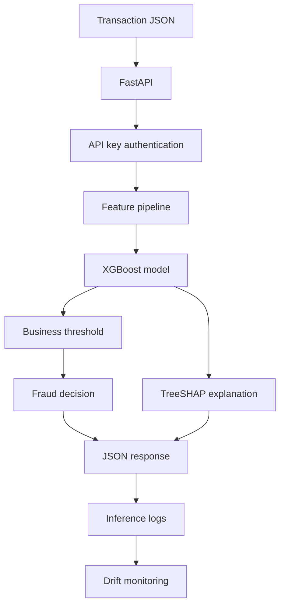

[README_ieee_fraud_detection.md](https://github.com/user-attachments/files/28164504/README_ieee_fraud_detection.md)
# IEEE-CIS Fraud Detection System


End-to-end fraud detection system built on the IEEE-CIS Fraud Detection dataset.

The project covers the full machine learning lifecycle: exploratory data analysis, leakage-safe feature engineering, model benchmarking, XGBoost fraud scoring, FastAPI deployment, API key authentication, SHAP explanations, inference logging, drift monitoring, and Dockerized local deployment.

Dataset: [IEEE-CIS Fraud Detection](https://www.kaggle.com/c/ieee-fraud-detection)  
Training data: 590,540 transactions  
Fraud rate: approximately 3.5%

---

## What The System Does

The API receives a transaction payload and returns:

- A fraud score between 0 and 1
- A fraud / not-fraud decision using a business threshold
- SHAP feature explanations for investigation workflows
- Request-level inference metadata for monitoring and auditability

The deployed threshold is optimized for business cost, not raw F1 score.

| Event | Cost |
|---|---:|
| Missed fraud | $250 |
| False alarm | $15 |

---

## Model Performance

The test set was evaluated once, after final model selection.

| Model | Validation AUC-PR | Validation ROC-AUC | Test AUC-PR | Test ROC-AUC |
|---|---:|---:|---:|---:|
| Logistic Regression baseline | 0.267 | 0.747 | Not evaluated | Not evaluated |
| Random Forest benchmark | 0.493 | 0.899 | Not evaluated | Not evaluated |
| XGBoost deployed model | 0.613 | 0.931 | 0.551 | 0.911 |

Deployed model:

```text
XGBoost depth-5 generalized model
Validation AUC-PR: 0.613
Test AUC-PR:       0.551
Threshold:         0.1104
```

Estimated business impact:

```text
Approximate validation-cycle savings vs no-model baseline: $492,000
```

This is an offline estimate based on the project cost matrix.

---

## Architecture



Feature pipeline:

```text
432 raw columns -> 905 model features
```

Main feature groups:

- Datetime features: hour, day cycle, weekend flag
- Amount features: log amount, rounded amount, cents
- Email features: frequency encoding and domain matching
- Card aggregations: card-level amount mean, standard deviation, count
- Match features: M1-M9 encodings
- D features: missing indicators and sentinel imputation
- Identity features: identity presence and imputation
- V features: raw / PCA strategy selected by validation AUC-PR

All fitted transformations are learned on the training split only.

---

## Repository Structure

```text
ieee-fraud-detection/
├── api/
│   ├── main.py
│   ├── predict.py
│   ├── explain.py
│   └── schemas.py
├── data/
│   ├── raw/
│   ├── processed/
│   └── monitoring/
├── docker/
│   ├── Dockerfile
│   └── docker-compose.yml
├── models/
│   ├── xgb_generalized_primary.joblib
│   └── fraud_model_v1_config.json
├── notebooks/
│   ├── 01_eda.ipynb
│   ├── 02_feature_engineering.ipynb
│   └── 03_modeling.ipynb
├── src/
│   ├── features/
│   ├── models/
│   └── monitoring/
└── tests/
```

Model artifacts and processed data are gitignored because of size.

---

## Requirements

For Docker deployment:

- Docker
- Docker Compose
- Model artifacts provided separately

For local development:

- Python 3.11 recommended
- pandas
- numpy
- scikit-learn
- XGBoost
- FastAPI
- uvicorn
- SHAP
- MLflow
- scipy
- pytest

---

## Setup

### 1. Clone the repository

```bash
git clone https://github.com/ilyas-elm/ieee-fraud-detection
cd ieee-fraud-detection
```

### 2. Create the API key

Create a `.env` file:

```bash
echo "FRAUD_API_KEY=your-secret-key" > .env
```

All API endpoints require this key except `/health`.

### 3. Add model artifacts

The following files must exist before deployment:

```text
models/xgb_generalized_primary.joblib
models/fraud_model_v1_config.json
data/processed/feature_pipeline.joblib
data/monitoring/reference.csv
```

These files are not committed to Git because of size.

### 4. Start the API

```bash
docker-compose -f docker/docker-compose.yml up --build
```

The API will be available at:

```text
http://localhost:8000
```

---

## API Usage

### Health Check

No API key required.

```bash
curl http://localhost:8000/health
```

Example response:

```json
{
  "status": "ok",
  "model_version": "v1",
  "threshold": 0.1104
}
```

### Predict Fraud

```bash
curl -X POST http://localhost:8000/predict \
  -H "Content-Type: application/json" \
  -H "X-API-Key: your-secret-key" \
  -d '{
    "request_id": "demo-001",
    "schema_version": "v1",
    "TransactionAmt": 120.50,
    "TransactionDT": 1000000,
    "ProductCD": "W",
    "card1": 12345,
    "card4": "visa",
    "P_emaildomain": "gmail.com",
    "R_emaildomain": "gmail.com"
  }'
```

Example response:

```json
{
  "request_id": "demo-001",
  "fraud_probability": 0.178,
  "is_fraud": true,
  "threshold_used": 0.1104,
  "model_version": "v1",
  "score_is_calibrated": false,
  "score_type": "xgboost_predict_proba",
  "inference_time_ms": 131.4
}
```

Notes:

- `fraud_probability` is the model score returned by XGBoost.
- The score is used for ranking and thresholding.
- The score should not be interpreted as a perfectly calibrated real-world probability.
- Missing raw fields are filled with `NaN` and handled by the saved feature pipeline.

### Explain A Prediction

```bash
curl -X POST http://localhost:8000/explain \
  -H "Content-Type: application/json" \
  -H "X-API-Key: your-secret-key" \
  -d '{
    "request_id": "demo-001",
    "schema_version": "v1",
    "TransactionAmt": 120.50,
    "TransactionDT": 1000000,
    "ProductCD": "W",
    "card1": 12345,
    "card4": "visa",
    "P_emaildomain": "gmail.com",
    "top_k": 5
  }'
```

Example response:

```json
{
  "request_id": "demo-001",
  "fraud_probability": 0.178,
  "is_fraud": true,
  "threshold_used": 0.1104,
  "model_version": "v1",
  "explanation_method": "xgboost_native_treeshap",
  "explanation_space": "raw_margin_log_odds",
  "top_features": [
    {
      "feature": "C13",
      "feature_value": 12.0,
      "shap_value": 0.57,
      "abs_shap_value": 0.57,
      "direction": "increases_fraud_score"
    },
    {
      "feature": "amt_log",
      "feature_value": 4.80,
      "shap_value": -0.34,
      "abs_shap_value": 0.34,
      "direction": "decreases_fraud_score"
    }
  ]
}
```

SHAP values explain movement in the model's raw margin / log-odds space, not direct probability changes.

### Batch Prediction

```bash
curl -X POST http://localhost:8000/predict-batch \
  -H "Content-Type: application/json" \
  -H "X-API-Key: your-secret-key" \
  -d '[
    {
      "request_id": "tx-001",
      "schema_version": "v1",
      "TransactionAmt": 120.50,
      "ProductCD": "W"
    },
    {
      "request_id": "tx-002",
      "schema_version": "v1",
      "TransactionAmt": 999.99,
      "ProductCD": "C"
    }
  ]'
```

---

## Authentication

All endpoints except `/health` require:

```text
X-API-Key: your-secret-key
```

If the key is missing or invalid, the API returns status code `401`.

---

## Inference Logging

Prediction requests are logged to:

```text
logs/predictions.jsonl
```

Explanation requests are logged to:

```text
logs/explanations.jsonl
```

Logs include:

- Request ID
- Timestamp
- Model version
- Fraud score
- Decision
- Threshold
- Inference latency

Payloads are not logged by default.

---

## Drift Monitoring

After collecting inference traffic, run:

```python
from src.monitoring.drift import generate_drift_report

report = generate_drift_report()
```

The drift report compares recent inference logs against reference data.

| Signal | Method | Purpose |
|---|---|---|
| TransactionAmt | PSI | Input feature drift |
| amt_log | PSI | Input feature drift |
| card1_amt_mean | PSI | Behavioral drift |
| fraud_probability | KS test | Prediction score drift |

Report output:

```text
logs/drift_report.json
```

Review the model if:

```text
PSI > 0.20
KS p-value < 0.05
```

---

## Running Tests

```bash
pytest tests/ -v
```

Test coverage includes:

- Feature engineering leakage checks
- Unseen-card fallback behavior
- API authentication
- `/health`, `/predict`, `/explain`
- Drift metric functions

---

## Reproducing The Model

### 1. Download raw data

Download the IEEE-CIS Fraud Detection dataset from Kaggle and place:

```text
data/raw/train_transaction.csv
data/raw/train_identity.csv
```

### 2. Run feature engineering

```bash
jupyter notebook notebooks/02_feature_engineering.ipynb
```

This creates:

```text
data/processed/X_train.csv
data/processed/X_val.csv
data/processed/X_test.csv
data/processed/feature_pipeline.joblib
```

### 3. Run modeling

```bash
jupyter notebook notebooks/03_modeling.ipynb
```

This trains:

- Logistic Regression baseline
- Random Forest benchmark
- XGBoost primary model

### 4. View MLflow experiments

```bash
mlflow ui
```

Then open:

```text
http://localhost:5000
```

---

## Known Limitations

| Area | Limitation | Reason |
|---|---|---|
| Latency | p99 target of 100ms is not always met | 905-feature pipeline in local Docker can exceed budget |
| Calibration | Model score is not formally calibrated | Threshold is business-cost optimized |
| Artifacts | Model artifacts are not committed | Files are too large for Git |
| Reference data | CSV used instead of Parquet | Python 3.14 / pyarrow compatibility issue during development |
| Deployment | Local Docker only | No Kubernetes or cloud deployment in scope |
| Streaming | No Kafka or event queue | Batch/streaming infra out of scope |
| Security | API key authentication only | No OAuth, rate limiting, or WAF in local project scope |

---

## Tech Stack

```text
Python 3.11
pandas
numpy
scikit-learn
XGBoost
FastAPI
uvicorn
Pydantic
SHAP / TreeSHAP
MLflow
Docker
pytest
scipy
```

---

## Project Status

The project is complete as a local end-to-end fraud detection system.

Implemented:

- Leakage-safe feature engineering
- Model benchmarking
- Final XGBoost model
- Dockerized FastAPI deployment
- API key authentication
- Prediction endpoint
- Explanation endpoint
- Inference logging
- Drift monitoring
- CI tests

Out of scope:

- Cloud deployment
- Real-time streaming ingestion
- Human review dashboard
- Automated retraining pipeline
